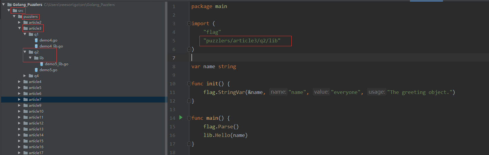
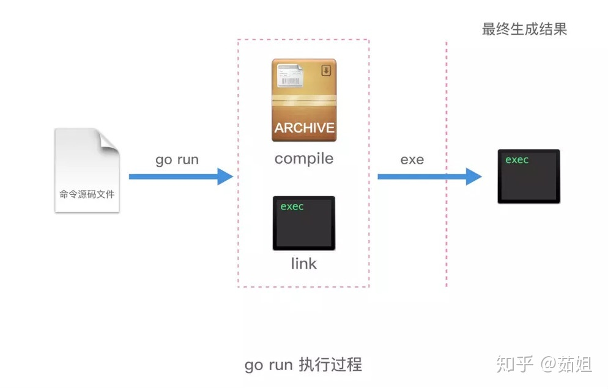
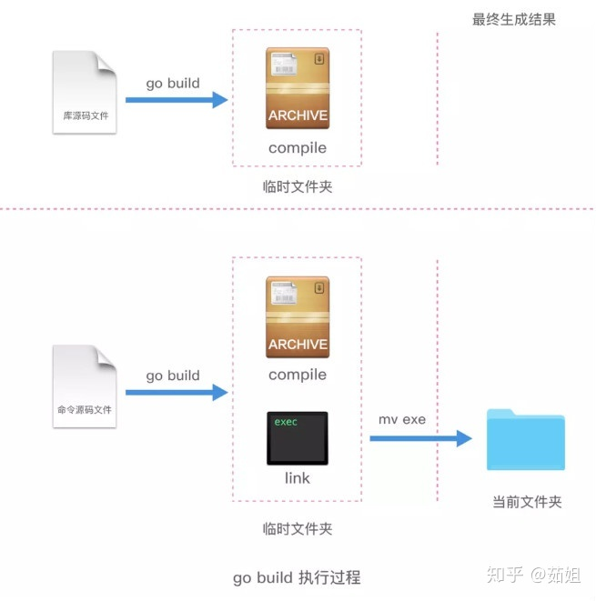
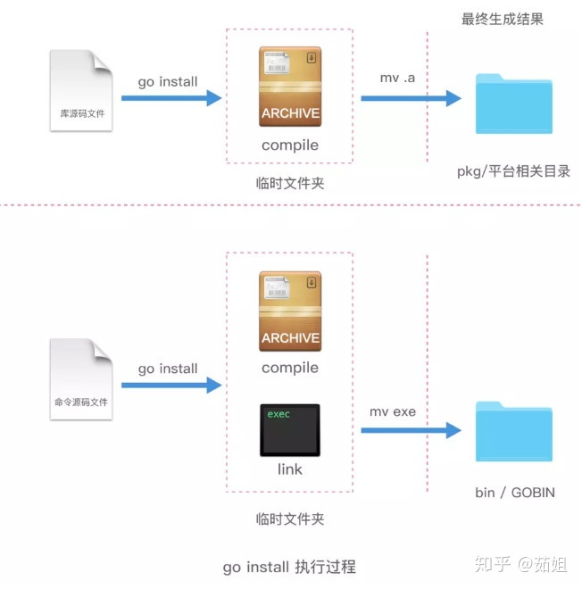

# 工作区和 GoPath

* GOROOT：go sdk 所在的路径
* **GOPATH**：项目目录
* GOBIN：GO 程序生成的可执行文件（executable file）的路径


## import

```go
//${gopath)/src/puzzlers/article3/q2/lib

import "puzzlers/article3/q2/lib"

// 见下面的图片
import "github.com/labstack/echo"
```

注意：文件名（demo.go）只有**可读意义**，go 的 import 是以包为单位的，而不是像 java 一样
是以 class 为单位的。


* src 里面就是项目
* pkg 里面就是 .a 文件
* bin 里面就是可执行文件（.exe 文件）

## 理解 go run, go build, go install

[原文](https://zhuanlan.zhihu.com/p/62893405)

* 命令文件：有 main() 的那个文件
* 库文件：非 main() 文件

### go run

只用来运行命令文件




### go build

* go build 用于编译指定的源码文件或代码包以及它们的依赖包
* go build 编译**库文件**时，只是检查库源码文件的有效性，只会做检查性的编译，而不会输出任何结果文件
* go build 编译**命令源码文件**，则会在该命令的**执行目录**中生成一个可执行文件



### go install

* go install 命令只比 go build 命令多做了一件事，即：安装编译后的结果文件到指定目录
* 安装代码包会在当前工作区的 pkg 的平台相关目录下生成归档文件（即 .a 文件）。 
* 安装命令源码文件会在当前工作区的 bin 目录（如果 GOPATH 下有多个工作区，就会放在 GOBIN 目录下）生成可执行文件



## 命令文件

Q：命令源码文件怎样接收参数


