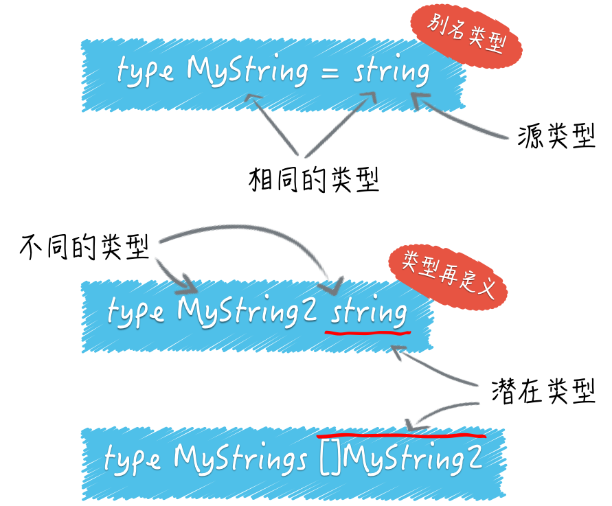

# 工作区和 GoPath

* GOROOT：go sdk 所在的路径
* **GOPATH**：项目目录
* GOBIN：GO 程序生成的可执行文件（executable file）的路径


## import

```go
//${gopath)/src/puzzlers/article3/q2/lib

import "puzzlers/article3/q2/lib"

// 见下面的图片
import "github.com/labstack/echo"
```

注意：文件名（demo.go）只有**可读意义**，go 的 import 是以包为单位的，而不是像 java 一样
是以 class 为单位的。


* src 里面就是项目
* pkg 里面就是 .a 文件
* bin 里面就是可执行文件（.exe 文件）

## 理解 go run, go build, go install

[原文](https://zhuanlan.zhihu.com/p/62893405)

* 命令文件：有 main() 的那个文件
* 库文件：非 main() 文件

### go run

只用来运行命令文件


### go build

* go build 用于编译指定的源码文件或代码包以及它们的依赖包
* go build 编译**库文件**时，只是检查库源码文件的有效性，只会做检查性的编译，而不会输出任何结果文件
* go build 编译**命令源码文件**，则会在该命令的**执行目录**中生成一个可执行文件


### go install

* go install 命令只比 go build 命令多做了一件事，即：安装编译后的结果文件到指定目录
* 安装代码包会在当前工作区的 pkg 的平台相关目录下生成归档文件（即 .a 文件）。 
* 安装命令源码文件会在当前工作区的 bin 目录（如果 GOPATH 下有多个工作区，就会放在 GOBIN 目录下）生成可执行文件


## 命令文件

* 搞清楚命令文件如何接受参数
* 自定义命令源码文件的参数使用说明

## 库文件

* 代码包声明规则、代码包导入规则以及程序实体的访问权限规则
* 同一个目录下的源码文件 package 都一样
* 源码文件的 package 可以不是目录名，但是建议定义为目录名
* 包级别：名称的首字母为大写的程序实体才可以被当前包外的代码引用，否则它就只能被当前包内的其他代码引用
* 模块级别：internal代码包中声明的公开程序实体仅能被该代码包的**直接父包**及其**子包**中的代码引用

## 程序实体

> Go 语言中的程序实体包括变量、常量、函数、结构体和接口

### 变量

* 类型推断：通过表达式的返回类型，来推断变量类型（好处就是灵活性）
```go
// flag.String("name", "everyone", "The greeting object.") 这个表达式返回类型是 *string
// 所以 name 的类型就是 *string
var name = flag.String("name", "everyone", "The greeting object.")
```
* 短变量声明
* Go 语言是静态类型的，所以一旦在初始化变量时确定了它的类型，之后就不可能再改变. 而且类型是在编译期确定的

### 代码块

每个源码文件也都是一个代码块，每个函数也是一个代码块，每个if语句、for语句、switch语句和select语句都是一个代码块。甚至，switch或select语句中的case子句也都是独立的代码块

* 变量重名按照作用域进行屏蔽，查找过程从小作用域查到大作用域

### 类型判断

```go
package main

import "fmt"

var container = []string{"zero", "one", "two"}

func main() {
  container := map[int]string{0: "zero", 1: "one", 2: "two"}
  fmt.Printf("The element is %q.\n", container[1])
}


value, ok := interface{}(container).([]string)
```

类型推断的表达式是 x.(T)，x 只要是接口类型的就行。如果 container 是接口类型的，就不用 interface{} 来包装了


类型转换表达式：T(x)

* 对于整数类型值、整数常量之间的类型转换，原则上只要源值在目标类型的可表示范围内就是合法的
```go
var srcInt = int16(-255)
dstInt := int8(srcInt) // dstInt 为1 ，范围变窄，高位会被截掉
```
* 把一个整数值转换为一个string类型的值是可行的，但值得关注的是，被转换的整数值应该可以代表一个有效的 Unicode 代码点，否则转换的结果将会是"�"
* string类型与各种切片类型之间的互转的(要熟悉Unicode 标准)

```go

str := "Go爱好者"
for i, c := range str {
 fmt.Printf("%d: %q [% x]\n", i, c, []byte(string(c)))
}


0: 'G' [47]
1: 'o' [6f]
2: '爱' [e7 88 b1]
5: '好' [e5 a5 bd]
8: '者' [e8 80 85]
```


   
### Unicode

[原文](http://www.ruanyifeng.com/blog/2007/10/ascii_unicode_and_utf-8.html)
    
* 当一个string类型的值被转换为[]rune类型值的时候，其中的字符串会被拆分成一个一个的 Unicode 字符
* 一个string类型的值是由一系列相对应的 Unicode 代码点的 UTF-8 编码值来表达的
* 一个string类型的值会由若干个 Unicode 字符组成，每个 Unicode 字符都可以由一个rune类型的值来承载
* 这些字符在底层都会被转换为 UTF-8 编码值，而这些 UTF-8 编码值又会以字节序列的形式表达和存储。因此，一个string类型的值在底层就是一个能够表达若干个 UTF-8 编码值的字节序列
* Unicode 编码规范中的编码格式定义的是：字符与字节序列之间的转换方式。其中的 UTF-8 是一种可变宽的编码方案


