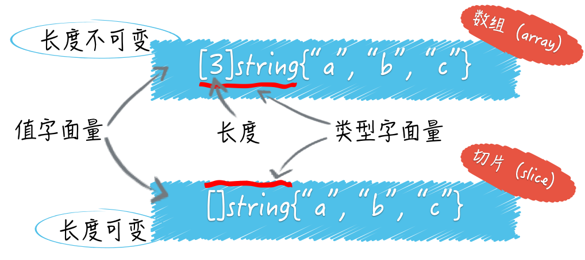

# array 和 slice



## array

* 数组是一个值类型，在函数之前传递的时候，是需要拷贝的

## slice

* 这个数据结构和 java 里面很不一样
* 底层是数组支撑的
```go
s3 := []int{1, 2, 3, 4, 5, 6, 7, 8}
s4 := s3[3:6]
fmt.Printf("The length of s4: %d\n", len(s4))  // 3
fmt.Printf("The capacity of s4: %d\n", cap(s4)) // 5，容量是从开始索引指向数据末尾的长度
fmt.Printf("The value of s4: %d\n", s4)
```
* 扩容机制 (slice.go)

## list 、ring

* 开箱即用

## map

* 键的类型是受限的，而元素却可以是任意类型的
* Go 语言字典的键类型不可以是函数类型、字典类型和切片类型
* 应该优先考虑哪些类型作为字典的键类型
    * 求哈希和判等操作的速度越快，对应的类型就越适合作为键类型
    * 对结构体类型的值求哈希实际上就是对它的所有字段值求哈希并进行合并，所以关键在于它的各个字段的类型以及字段的数量。而对于接口类型，具体的哈希算法，则由值的实际类型决定
    * 推荐使用 数值类型和指针类型
    
## channel

* 对于同一个通道，发送操作之间是互斥的，接收操作之间也是互斥的
* 发送操作在完全完成之前会被阻塞。接收操作也是如此
* 元素值从外界进入通道时会被复制
* 出通道：第一步是生成正在通道中的这个元素值的副本，并准备给到接收方，第二步是删除在通道中的这个元素值
* 发送操作包括了“复制元素值”和“放置副本到通道内部”这两个步骤。
* 接收操作通常包含了“复制通道内的元素值”“放置副本到接收方”“删掉原值”三个步骤
* 发送操作和接收操作在什么时候可能被长时间的阻塞
    * 通道会优先通知最早因此而等待的、那个发送操作所在的 goroutine，后者会再次执行发送操作
    * 等待的、所有接收操作所在的 goroutine，都会按照先后顺序被放入通道内部的接收等待队列
* 通道一旦关闭，再对它进行发送操作，就会引发 panic
* 关闭一个已经关闭了的通道，也会引发 panic
* select语句只能与通道联用，每次执行这种语句的时候，一般只有一个分支中的代码会被运行

## 函数

* 函数定义和实现
* 高阶函数和闭包

## 结构体

* 只要名称相同，无论这两个方法的签名是否一致，被嵌入类型的方法都会“屏蔽”掉嵌入字段的同名方法
* 即使在两个同名的成员一个是字段，另一个是方法的情况下，这种“屏蔽”现象依然会存在

## interface
* 这个和 java 很不一样
* **如果我们使用一个变量给另外一个变量赋值，那么真正赋给后者的，并不是前者持有的那个值，而是该值的一个副本**
* 当我们给一个接口变量赋值的时候，该变量的动态类型会与它的动态值一起被存储在一个专用的数据结构中
* iface的实例会包含两个指针，一个是指向类型信息的指针，另一个是指向动态值的指针
    * 接口变量被赋予动态值的时候，存储的是包含了这个动态值的副本的一个结构更加复杂的值
* Go 语言的接口常用于代表某种能力或某类特征。
    * 首先，我们要弄清楚的是，接口变量的动态值、动态类型和静态类型都代表了什么。这些都是正确使用接口变量的基础。当我们给接口变量赋值时，接口变量会持有被赋予值的副本，而不是它本身。
    * 更重要的是，接口变量的值并不等同于这个可被称为动态值的副本。它会包含两个指针，一个指针指向动态值，一个指针指向类型信息
    
    
## 指针

* 哪些值是不可寻址
    * 不可变的
    * 临时结果
        * 例外：切片字面量的索引结果值是可寻址的
    * 不安全的

